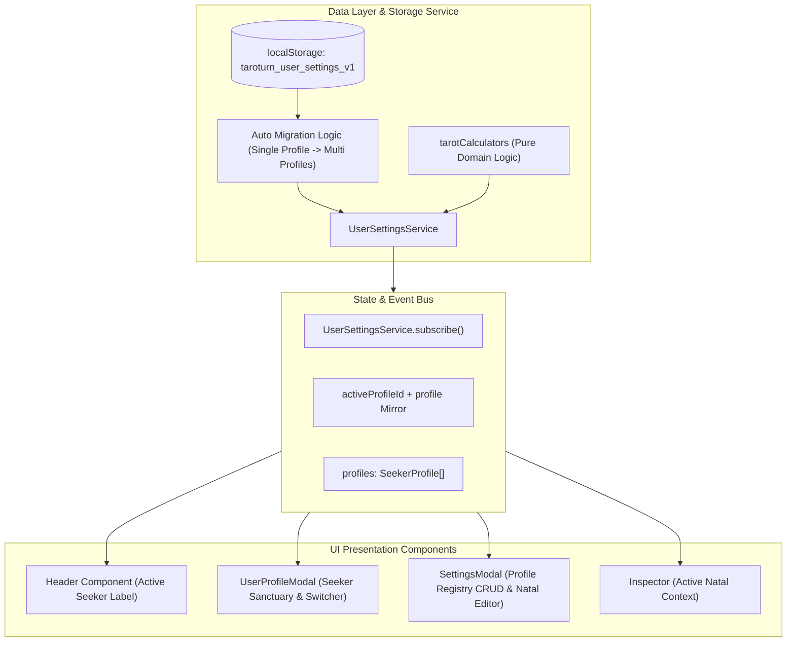

# Implementation Plan: Multi-Profile Natal Tarot Registry

- **Feature ID**: `007-multi-profile-natal-tarot`
- **Status**: `PLANNED`
- **Author**: Antigravity / CTO Persona
- **Target Branch**: `main`
- **Created Date**: `2026-08-25`

---

## 1. Technical Architecture & Component Decomposition

---

## 2. Component Modification Plan

### 2.1 Domain Types (`apps/taroturn-app/src/types/settings.ts`)
- 扩展 `SeekerProfile` 接口：
  - 新增 `id: string`
  - 新增 `name: string` (自定义名称，如 "我自己" 或 "林澈 (伴侣)")
  - 新增 `createdAt?: string`
  - 新增 `updatedAt?: string`
- 扩展 `UserSettings` 接口：
  - 新增 `profiles: SeekerProfile[]`
  - 新增 `activeProfileId: string`

### 2.2 Core Storage Service (`apps/taroturn-app/src/services/userSettingsService.ts`)
- 完善 `DEFAULT_SETTINGS` 初始值：
  - `activeProfileId: 'default-seeker'`
  - `profiles: [DEFAULT_SEEKER_PROFILE]`
  - `profile: DEFAULT_SEEKER_PROFILE`
- 升级 `getSettings()`：
  - 自动检测如果已存数据只有 `profile` 没有 `profiles`，自动封装为 `profiles = [{ ...profile, id: 'default-seeker', name: profile.nickname || '默认求问者' }]` 并将 `activeProfileId = 'default-seeker'`。
  - 确保返回的 `settings.profile` 与 `activeProfileId` 对应的档案同步。
- 新增 CRUD 与状态方法：
  - `createProfile(data: { name: string; nickname?: string; title?: string; birthdate: string }): SeekerProfile`
  - `updateProfile(id: string, data: Partial<SeekerProfile>): SeekerProfile`
  - `deleteProfile(id: string): boolean` (若只剩 1 个则拒绝并返回 false；若删除的是当前活跃档案，自动将活跃档案切换为首个有效档案)
  - `setActiveProfile(id: string): void`
- 升级 `exportFullBackupJson` / `importBackupJson`：保证多档案结构无损导入导出。

### 2.3 UI Component: `UserProfileModal.tsx`
- 顶部导航栏新增求问者切换卡片/选择器：
  - 显示当前选中的求问者名称与称号。
  - 点击可展开切换菜单（列出所有档案）或横向滑动卡片。
  - 支持快速“＋新建求问者”按钮，点击可直接呼出简洁创建表单或跳转设置。
- 保证神殿内展示的所有数据（本命灵魂牌、生命灵数、星座、元素、优势与阴影课题）直接渲染当前选中档案。

### 2.4 UI Component: `SettingsModal.tsx`
- 改造“求问者与本命灵数”Tab：
  - **顶部**：提供“新建档案”按钮与档案总数徽章。
  - **档案列表区 (Registry List)**：以精美卡片网格呈现已保存的所有求问者：
    - 卡片包含：姓名、称号、生日、生命灵数、本命灵魂牌封面缩略图与星座徽章。
    - 状态标识：“当前活跃”徽章。
    - 操作项：“设为当前活跃”、“编辑档案”、“删除档案”（单档案时置灰）。
  - **模态/抽屉编辑表单 (Edit/Create Drawer or Sub-view)**：
    - 表单字段：姓名/备注 (`name`)、昵称 (`nickname`)、称号 (`title`)、出生日期 (`birthdate`)。
    - 实时响应：修改出生日期时，即时在右侧/下方展示计算得出的灵魂本命牌、灵数与心智画像。
    - 保存与取消操作。

### 2.5 UI Component: `Header.tsx`
- 确保顶部求问者状态入口展示当前活跃求问者的姓名与称号。

---

## 3. Verification & Safety Gates

1. **Contract Linting**: `lint-contracts.sh` 验证所有 JSON Schema。
2. **Tasks Linting**: `lint-tasks.sh` 验证任务依赖格式与并发安全性。
3. **Automated Unit Tests**:
   - 编写针对 `UserSettingsService` 的多档案 CRUD 单元测试（新建、更新、删除最后一人防御、切换活跃、旧数据迁移、导入导出）。
4. **Interactive Verification**:
   - 启动本地前端开发环境，通过 Vite 构建验证无 TypeScript 编译错误与 ESLint 报错。
