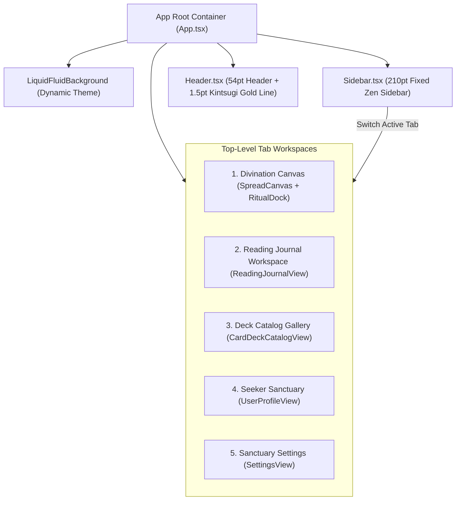

# Implementation Plan: Zen Sidebar Navigation & Native Tab Workspaces

- **Feature ID**: `008-zen-sidebar-navigation-architecture`
- **Status**: `PLANNED`
- **Author**: Antigravity / CTO Persona
- **Target Branch**: `main`
- **Created Date**: `2026-08-25`

---

## 1. Technical Architecture

---

## 2. Component Modification & Transformation

### 2.1 Refactor `Sidebar.tsx`
- 宽度设为 `w-[210px]` 或 `w-[220px]`，玻璃拟态背景，符合 `ttzip-ui-design-system`。
- 顶部：TAROTURN 品牌 Logo + 典雅花体 + WSJ 编辑级排版。
- 中间：5 大核心导航 Tab 按钮：
  - ✦ **圣所推演** (`divination`, Sparkles)
  - 📖 **历史账本** (`journal`, History)
  - 🎴 **牌典图谱** (`catalog`, Layers)
  - 👤 **本命神殿** (`profiles`, User)
  - ⚙️ **认知中枢** (`settings`, Sliders)
  - 激活态：`bg-kintsugiGold/15 text-kintsugiGold border-l-2 border-kintsugiGold shadow-sm font-bold`。
- 底部：当前活跃求问者身份卡片（名字 + 称号 + 本命牌编号）、PRO 尊享勋章、版本与引擎状态。

### 2.2 Refactor `Header.tsx`
- 54pt 高度，底部配备 1.5pt 金缮金线（`golden-rule-line`）。
- 左侧：动态展示当前 Tab 的 Section 英文标签（如 `DIVINATION SANCTUARY`, `DECK CATALOG`）与大标题。当处于 `divination` Tab 时展示牌阵下拉选择器。
- 右侧：全景推演抽屉快捷入口（当有已抽牌 session 时）、日/夜模式切换、当前求问者快捷药丸、PRO 勋章。

### 2.3 Refactor Modals to First-Class Views
- **`CardDeckCatalogView`**（原 `CardDeckCatalogModal`）：直接作为全屏/容器内嵌组件渲染在 `catalog` Tab 中，展示 78 张卡牌大画廊、四大元素选项卡、实时搜索。
- **`ReadingJournalView`**（原 `ReadingJournalModal`）：直接渲染在 `journal` Tab 中，展示历史推演卡片网格、四要素统计分析、AI 复盘与一键重放。
- **`UserProfileView`**（原 `UserProfileModal`）：直接渲染在 `profiles` Tab 中，展示多求问者档案库管理、实时灵数推演与心智画像。
- **`SettingsView`**（原 `SettingsModal`）：直接渲染在 `settings` Tab 中，展示 AI 节点接入、四大导师流派、仪式引擎与禅意音效。

### 2.4 Refactor `App.tsx`
- 顶层由 `flex flex-col` 升级为 `flex h-screen overflow-hidden`：
  - 左侧：常驻 `<Sidebar activeTab={activeTab} onSelectTab={setActiveTab} />`
  - 右侧：`flex-1 flex flex-col h-full overflow-hidden`，顶部为 `<Header />`，下方为 `<main className="flex-1 overflow-y-auto">` 自适应当前 Tab 内容。
- 保持推演会话状态（`session`, `revealedSlots`, `question` 等）在 Tab 切换时完全不被销毁。
